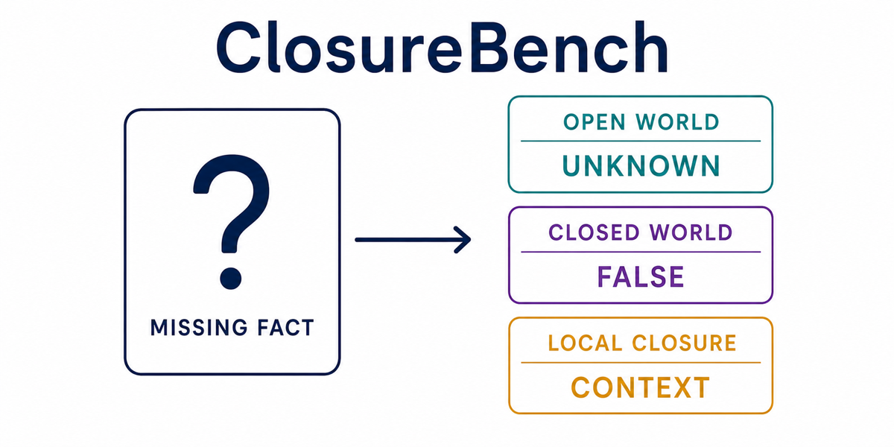

# ClosureBench

[](#paper)
[](https://nesy-ai.org/conferences/nesy-2026)
[](https://www.python.org/)
[](https://github.com/MatteoLeonesi/ClosureBench-nesyai/stargazers)



ClosureBench evaluates whether language models distinguish **unknown** from
**false** under open-world, closed-world, and locally closed-world assumptions.
It includes a base benchmark plus Ask/Act, Multi-Agent, and Dynamic Dialogue
extensions.

## Quick start

The benchmark uses only the Python standard library.

```bash
python3 scripts/validate_base_dataset.py
```

Set the API key required by your provider, then run the configured evaluation:

```bash
export OPENROUTER_API_KEY=...
python3 scripts/run_replicate_suite.py \
  --models configs/closurebench_replicate_models.example.json \
  --repeats 3 \
  --shards 4
```

Regenerate the aggregate summary from the included scored runs:

```bash
python3 scripts/aggregate_replicate_results.py \
  --dataset data/closurebench_base.jsonl \
  --manifest reports/closurebench_replicate_manifest.json
```

## Repository layout

| Path | Contents |
|---|---|
| `data/` | Base and extension datasets with metadata. |
| `configs/` | Example model and provider configurations. |
| `results/` | Final scored JSONL runs used for the reported metrics. |
| `reports/` | Aggregate summaries, manifests, and model comparisons. |
| `scripts/` | Dataset generation, evaluation, validation, and analysis. |

Raw provider output dumps are excluded to keep the repository compact and
reviewable.

## Paper

The paper link and citation will be added after publication.

Conference:
[20th International Conference on Neurosymbolic Learning and Reasoning (NeSy 2026)](https://nesy-ai.org/conferences/nesy-2026),
Lisbon, Portugal, 1–4 September 2026.
